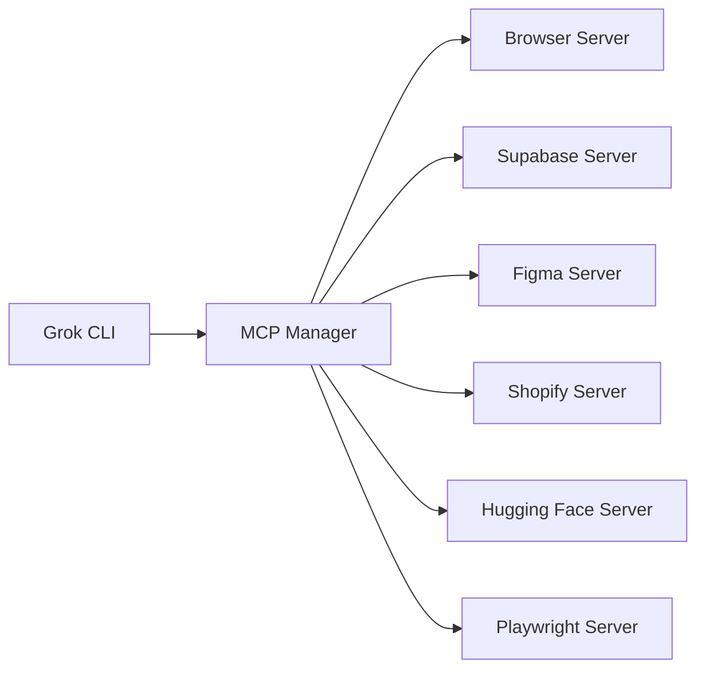

# 🔌 **MCP Integration Guide for Grok CLI**

**Model Context Protocol (MCP) Server Integration**  
*Enhanced AI capabilities through specialized server connections*

---

## 📋 **Table of Contents**

1. [What is MCP?](#what-is-mcp)
2. [Available MCP Servers](#available-mcp-servers)
3. [Quick Start](#quick-start)
4. [CLI Commands](#cli-commands)
5. [Python API Usage](#python-api-usage)
6. [Server-Specific Guides](#server-specific-guides)
7. [Integration Examples](#integration-examples)
8. [Advanced Usage](#advanced-usage)
9. [Troubleshooting](#troubleshooting)

---

## 🤔 **What is MCP?**

**Model Context Protocol (MCP)** is a standardized way to connect AI assistants to external data sources and tools. It enables your Grok CLI to access specialized capabilities through various "servers" that provide specific functionality.

### **Key Benefits:**
- 🔧 **Modular Tools**: Add specialized capabilities on-demand
- 🚀 **Standardized Interface**: Consistent way to interact with different services
- ⚡ **Dynamic Loading**: Activate/deactivate servers at runtime
- 🛠️ **Rich Ecosystem**: Access to browsers, databases, design tools, and more

### **How It Works:**


---

## 🌐 **Available MCP Servers**

Your Grok CLI has access to 6 major MCP servers:

### **🌐 Browser Tools**
- **Purpose**: Web testing and automation
- **Tools**: Screenshots, audits, console logs, network monitoring
- **Use Cases**: Web development, testing, debugging

### **🎭 Playwright Browser**
- **Purpose**: Advanced browser automation
- **Tools**: Navigation, form filling, test generation, user interactions
- **Use Cases**: E2E testing, web scraping, automated workflows

### **🗄️ Supabase Database**
- **Purpose**: Database and backend operations
- **Tools**: SQL queries, table management, edge functions, migrations
- **Use Cases**: Database administration, backend development

### **🎨 Figma Design**
- **Purpose**: Design-to-code conversion
- **Tools**: Code generation, variable extraction, image export
- **Use Cases**: Frontend development, design system management

### **🛒 Shopify Development**
- **Purpose**: E-commerce development tools
- **Tools**: Documentation search, API references, setup guides
- **Use Cases**: Shopify app development, e-commerce solutions

### **🤗 Hugging Face AI**
- **Purpose**: AI/ML models and datasets
- **Tools**: Model search, dataset discovery, image generation
- **Use Cases**: Machine learning, AI research, model deployment

---

## 🚀 **Quick Start**

### **1. Basic Setup**

Ensure your environment is configured:

```bash
# Install dependencies
pip install -r requirements.txt

# Set up environment (if not done already)
grok-cli setup

# Test MCP integration
grok-cli test --mcp
```

### **2. Start with MCP-Enhanced Agent**

```bash
# Launch CLI with MCP support
grok-cli chat --mcp
```

### **3. List Available Servers**

```bash
# From CLI
grok-cli mcp servers

# Or within chat
mcp servers
```

### **4. Activate Your First Server**

```bash
# In chat mode
activate huggingface

# Now you can use AI/ML tools
Search for image generation models
```

---

## 💻 **CLI Commands**

### **Main Commands**

```bash
# Start MCP-enhanced chat
grok-cli chat --mcp

# List all MCP servers
grok-cli mcp servers

# Get server details
grok-cli mcp info browser

# Run interactive demo
grok-cli mcp demo

# Show all available tools
grok-cli tools

# Show configuration
grok-cli config
```

### **Chat Commands (MCP Mode)**

When using `grok-cli chat --mcp`, you have special commands:

```bash
# Server Management
activate server_name       # Activate an MCP server
deactivate server_name     # Deactivate an MCP server
mcp status                 # Show MCP server status
mcp servers               # List available servers

# Standard Commands
quit/exit                 # Exit chat
```

---

## 🐍 **Python API Usage**

### **Basic MCP-Enhanced Agent**

```python
from grok_cli.mcp_enhanced_agent import MCPEnhancedGrokAgent

# Initialize agent
agent = MCPEnhancedGrokAgent()

# Show available servers
servers = agent.list_available_mcp_servers()
print("Available servers:", list(servers.keys()))

# Activate a server
success = agent.activate_mcp_server('huggingface')
print(f"Hugging Face activated: {success}")

# Use the enhanced capabilities
response = agent.chat("Search for FLUX image generation models")
```

### **MCP Server Manager**

```python
from grok_cli.mcp_integration import MCPServerManager

# Initialize manager
manager = MCPServerManager()

# List servers
servers = manager.list_available_servers()
for name, info in servers.items():
    print(f"{name}: {info['description']}")

# Activate server
tools = manager.activate_server('browser')
print(f"Activated {len(tools)} browser tools")

# Check status
status = manager.get_server_status()
active = [s for s, active in status.items() if active]
print(f"Active servers: {active}")
```

### **Dynamic Tool Management**

```python
# Start with basic tools
agent = MCPEnhancedGrokAgent()
print(f"Initial tools: {len(agent.tools)}")

# Add browser automation
agent.activate_mcp_server('browser')
agent.activate_mcp_server('playwright')
print(f"After browser tools: {len(agent.tools)}")

# Add database tools
agent.activate_mcp_server('supabase')
print(f"After database tools: {len(agent.tools)}")

# Remove browser tools
agent.deactivate_mcp_server('browser')
print(f"After removing browser: {len(agent.tools)}")
```

---

## 🎯 **Server-Specific Guides**

### **🌐 Browser Tools Server**

**Best for**: Web development, testing, debugging

```python
# Activate browser tools
agent.activate_mcp_server('browser')

# Example usage
agent.chat("Take a screenshot of the current page")
agent.chat("Run an accessibility audit")
agent.chat("Check for console errors")
agent.chat("Analyze network performance")
```

**Key Capabilities:**
- Screenshots and page capture
- Accessibility, performance, SEO audits
- Console log monitoring
- Network activity analysis
- Best practices validation

### **🎭 Playwright Browser Server**

**Best for**: Automated testing, web scraping, complex interactions

```python
# Activate Playwright
agent.activate_mcp_server('playwright')

# Example usage
agent.chat("Navigate to https://example.com")
agent.chat("Fill out the contact form")
agent.chat("Generate a test script for this workflow")
agent.chat("Click the submit button and wait for response")
```

**Key Capabilities:**
- Website navigation and interaction
- Form filling and submission
- Test script generation
- Element manipulation
- Multi-tab management

### **🗄️ Supabase Database Server**

**Best for**: Database management, backend development

```python
# Activate Supabase
agent.activate_mcp_server('supabase')

# Example usage
agent.chat("List my Supabase projects")
agent.chat("Show tables in my database")
agent.chat("Execute: SELECT * FROM users LIMIT 5")
agent.chat("Deploy a new edge function")
```

**Key Capabilities:**
- Project and organization management
- SQL query execution
- Table and schema management
- Edge function deployment
- Migration handling

### **🎨 Figma Design Server**

**Best for**: Design-to-code conversion, design systems

```python
# Activate Figma
agent.activate_mcp_server('figma')

# Example usage
agent.chat("Generate React code for node 123:456")
agent.chat("Extract design variables from this component")
agent.chat("Export high-res image of this design")
agent.chat("Show code connect mappings")
```

**Key Capabilities:**
- React/Vue code generation
- Design system variable extraction
- Image and asset export
- Component analysis

### **🛒 Shopify Development Server**

**Best for**: E-commerce development, Shopify apps

```python
# Activate Shopify
agent.activate_mcp_server('shopify')

# Example usage
agent.chat("Search for checkout customization examples")
agent.chat("Get started with Shopify Functions")
agent.chat("Find API docs for product management")
agent.chat("Show me storefront API examples")
```

**Key Capabilities:**
- Documentation search
- API reference lookup
- Getting started guides
- Best practices and examples

### **🤗 Hugging Face AI Server**

**Best for**: AI/ML development, model discovery

```python
# Activate Hugging Face
agent.activate_mcp_server('huggingface')

# Example usage
agent.chat("Search for image generation models")
agent.chat("Find datasets for sentiment analysis")
agent.chat("Generate an image using FLUX model")
agent.chat("Show trending AI models")
```

**Key Capabilities:**
- Model and dataset search
- Paper and documentation access
- Image generation
- Model details and usage info

---

## 🛠️ **Integration Examples**

### **Web Development Workflow**

```python
# Complete web development setup
agent = MCPEnhancedGrokAgent()

# Activate web development tools
agent.activate_mcp_server('browser')
agent.activate_mcp_server('playwright')
agent.activate_mcp_server('figma')

# Example workflow
agent.chat("Generate React code from Figma design 123:456")
agent.chat("Take a screenshot of localhost:3000")
agent.chat("Run accessibility audit on the page")
agent.chat("Generate test script for the main user flow")
```

### **Full-Stack Development**

```python
# Complete full-stack setup
agent = MCPEnhancedGrokAgent()

# Activate all relevant servers
servers = ['browser', 'supabase', 'figma', 'shopify']
for server in servers:
    agent.activate_mcp_server(server)

# Full-stack workflow
agent.chat("Create database schema for e-commerce app")
agent.chat("Generate React components from Figma designs")
agent.chat("Set up Shopify integration")
agent.chat("Test the complete checkout flow")
```

### **AI/ML Research**

```python
# AI research setup
agent = MCPEnhancedGrokAgent()
agent.activate_mcp_server('huggingface')

# Research workflow
agent.chat("Find state-of-the-art image generation models")
agent.chat("Search for datasets related to computer vision")
agent.chat("Generate sample images using FLUX")
agent.chat("Find research papers on diffusion models")
```

### **E-commerce Development**

```python
# E-commerce focused setup
agent = MCPEnhancedGrokAgent()

# Activate e-commerce tools
agent.activate_mcp_server('shopify')
agent.activate_mcp_server('browser')
agent.activate_mcp_server('figma')

# E-commerce workflow
agent.chat("Get started with Shopify app development")
agent.chat("Generate checkout UI from Figma design")
agent.chat("Test payment flow in browser")
agent.chat("Find examples for custom checkout fields")
```

---

## 🔧 **Advanced Usage**

### **Custom Server Configuration**

```python
# Custom MCP server management
from grok_cli.mcp_integration import MCPServerManager

class CustomMCPAgent(MCPEnhancedGrokAgent):
    def __init__(self, *args, **kwargs):
        super().__init__(*args, **kwargs)
        
        # Auto-activate preferred servers
        preferred_servers = ['browser', 'huggingface']
        for server in preferred_servers:
            self.activate_mcp_server(server)
    
    def smart_server_selection(self, query: str):
        """Automatically activate servers based on query"""
        query_lower = query.lower()
        
        if 'figma' in query_lower or 'design' in query_lower:
            self.activate_mcp_server('figma')
        elif 'database' in query_lower or 'sql' in query_lower:
            self.activate_mcp_server('supabase')
        elif 'shopify' in query_lower or 'ecommerce' in query_lower:
            self.activate_mcp_server('shopify')
        elif 'browser' in query_lower or 'website' in query_lower:
            self.activate_mcp_server('browser')
```

### **Batch Operations**

```python
# Activate multiple servers
def setup_development_environment(agent, workflow_type):
    """Set up agent for specific workflow"""
    
    workflows = {
        'web': ['browser', 'playwright', 'figma'],
        'backend': ['supabase', 'browser'],
        'ecommerce': ['shopify', 'browser', 'figma'],
        'ai': ['huggingface', 'browser'],
        'fullstack': ['browser', 'supabase', 'figma', 'shopify']
    }
    
    servers = workflows.get(workflow_type, [])
    for server in servers:
        success = agent.activate_mcp_server(server)
        print(f"{'✅' if success else '❌'} {server}")
    
    return len(servers)

# Usage
agent = MCPEnhancedGrokAgent()
setup_development_environment(agent, 'fullstack')
```

### **Tool Monitoring**

```python
# Monitor tool usage and performance
class MonitoredMCPAgent(MCPEnhancedGrokAgent):
    def __init__(self, *args, **kwargs):
        super().__init__(*args, **kwargs)
        self.tool_usage = {}
        self.server_performance = {}
    
    def activate_mcp_server(self, server_name: str) -> bool:
        """Track server activation"""
        start_time = time.time()
        result = super().activate_mcp_server(server_name)
        
        if result:
            activation_time = time.time() - start_time
            self.server_performance[server_name] = {
                'activation_time': activation_time,
                'activated_at': time.time()
            }
        
        return result
    
    def get_usage_stats(self):
        """Get tool usage statistics"""
        return {
            'active_servers': list(self.mcp_manager.active_servers),
            'total_tools': len(self.tools),
            'tool_usage': self.tool_usage,
            'server_performance': self.server_performance
        }
```

---

## 🐛 **Troubleshooting**

### **Common Issues**

#### **❌ Server Activation Failed**

```bash
# Check available servers
grok-cli mcp servers

# Verify server name spelling
grok-cli mcp info browser  # Correct
grok-cli mcp info browse   # Incorrect
```

#### **❌ Import Errors**

```python
# Check if modules are properly installed
try:
    from grok_cli.mcp_enhanced_agent import MCPEnhancedGrokAgent
    print("✅ MCP integration available")
except ImportError as e:
    print(f"❌ Import error: {e}")
    print("💡 Run: pip install -r requirements.txt")
```

#### **❌ No API Key**

```bash
# Check configuration
grok-cli config

# Set up environment
grok-cli setup

# Verify .env file
cat .env | grep GROK_API_KEY
```

### **Debugging Tools**

```python
# Enable verbose mode for debugging
agent = MCPEnhancedGrokAgent(verbose=True)

# Check agent status
config = agent.get_config()
print("Configuration:", config)

# Monitor tool execution
agent.list_available_tools()

# Test server connectivity
for server in ['browser', 'huggingface']:
    success = agent.activate_mcp_server(server)
    print(f"{server}: {'✅' if success else '❌'}")
```

### **Performance Optimization**

```python
# Optimize for specific workflows
class OptimizedMCPAgent(MCPEnhancedGrokAgent):
    def __init__(self, workflow_type='general', *args, **kwargs):
        super().__init__(*args, **kwargs)
        
        # Only activate servers needed for workflow
        workflow_servers = {
            'web': ['browser', 'figma'],
            'data': ['supabase', 'huggingface'],
            'ecommerce': ['shopify', 'browser']
        }
        
        if workflow_type in workflow_servers:
            for server in workflow_servers[workflow_type]:
                self.activate_mcp_server(server)

# Usage
agent = OptimizedMCPAgent('web')  # Only web-related tools
```

---

## 🎉 **Next Steps**

### **Try These Examples:**

1. **Web Development**: `grok-cli chat --mcp` → `activate browser` → "Take a screenshot and run audits"

2. **AI Research**: `activate huggingface` → "Find trending image generation models"

3. **Database Work**: `activate supabase` → "List my projects and show table schemas"

4. **Design-to-Code**: `activate figma` → "Generate React code from design node 123:456"

5. **E-commerce**: `activate shopify` → "Search for checkout customization examples"

### **Advanced Exploration:**

- Combine multiple servers for complex workflows
- Create custom automation scripts
- Build specialized agents for your use cases
- Integrate with CI/CD pipelines

### **Community Resources:**

- **Documentation**: [MCP Official Docs](https://modelcontextprotocol.io)
- **GitHub**: Issues and feature requests
- **Examples**: Check `test_mcp_integration.py` for more examples

---

## 📚 **Summary**

Your Grok CLI now has powerful MCP integration that provides:

✅ **6 Specialized Servers** with 50+ tools  
✅ **Dynamic Tool Management** - activate as needed  
✅ **Seamless Integration** with existing tools  
✅ **Rich CLI Interface** with MCP commands  
✅ **Python API** for custom automation  
✅ **Comprehensive Testing** and examples  

**Start exploring**: `grok-cli chat --mcp` and activate your first server! 🚀 